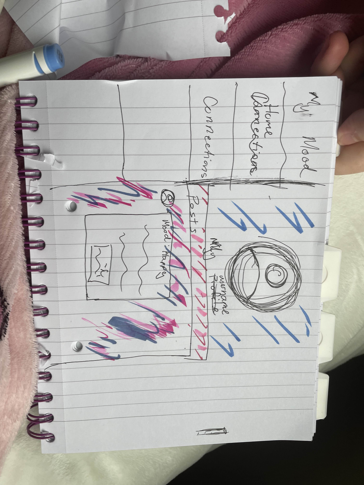
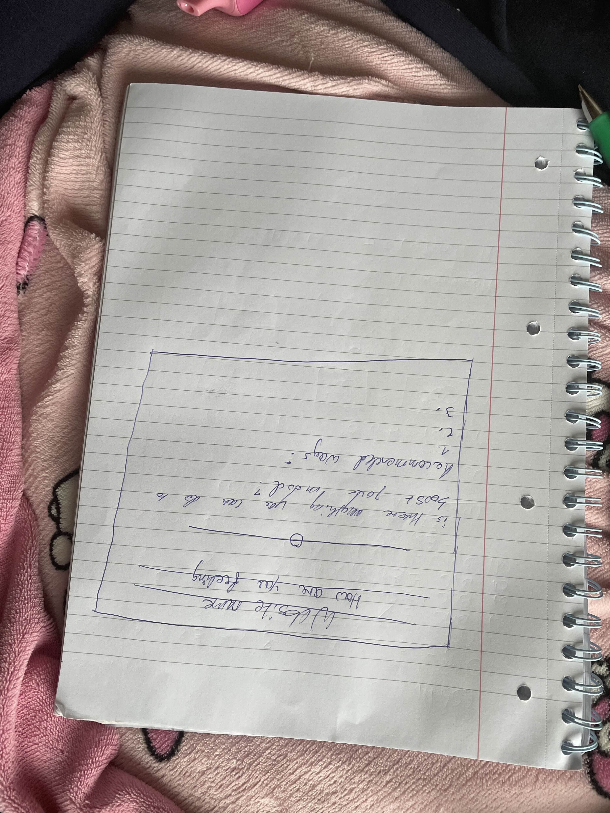
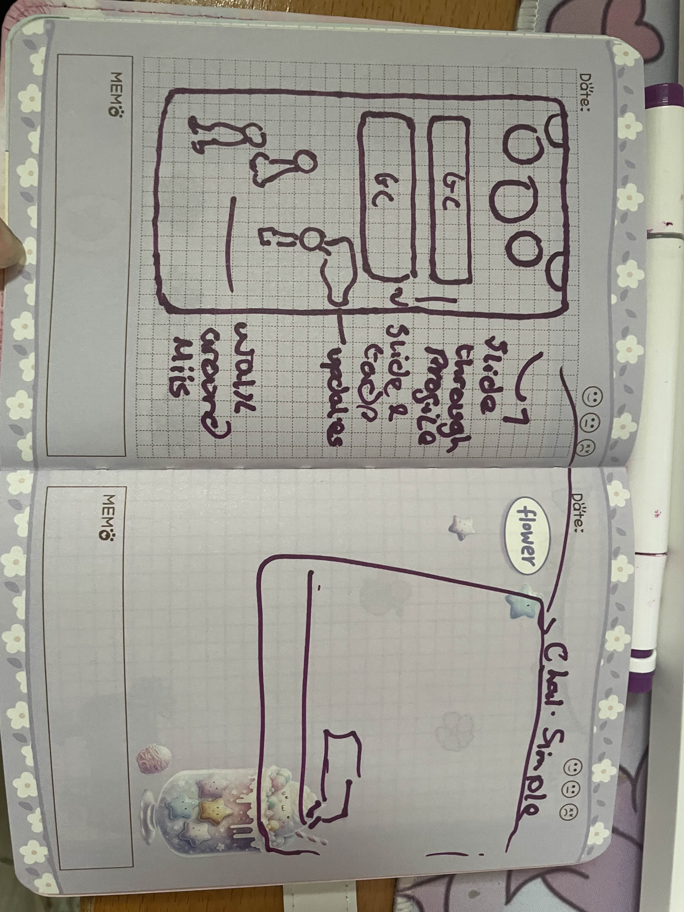
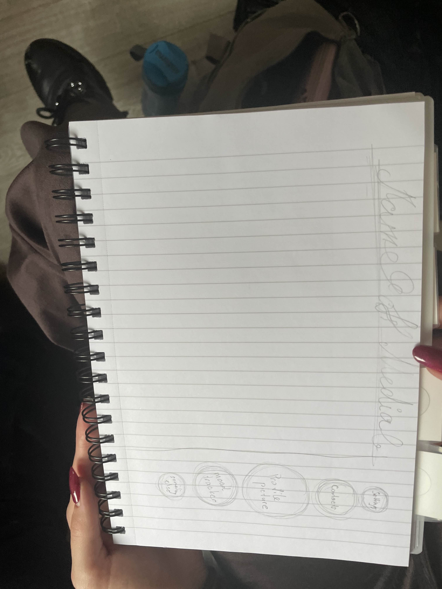

# Event Website – Tomorrowland

*A collaborative group project*

## Chosen Event

**Tomorrowland**
Website: [https://www.tomorrowland.com/](https://www.tomorrowland.com/)

Tomorrowland is a large-scale annual electronic dance music festival held in Boom, Antwerp, Belgium. Taking place within the De Schorre provincial recreational park, it held its first edition in 2005, based on an idea conceived by brothers Manu and Michiel Beers in 2004.

---

## Work Allocation

* **Main Page** – Diana
* **About Page** – Megan
* **Shop Page** – Lizzie
* **Booking Page** – Rachel

---

## Resources Used

* Accessibility: [https://developer.mozilla.org/en-US/docs/Web/Accessibility/ARIA/Reference/Attributes/aria-hidden](https://developer.mozilla.org/en-US/docs/Web/Accessibility/ARIA/Reference/Attributes/aria-hidden)
* General HTML Reference: [https://developer.mozilla.org/en-US/docs/Web/HTML/Guides/Cheatsheet](https://developer.mozilla.org/en-US/docs/Web/HTML/Guides/Cheatsheet)
* Pseudo Elements: [https://developer.mozilla.org/en-US/docs/Web/CSS/Reference/Selectors/Pseudo-elements](https://developer.mozilla.org/en-US/docs/Web/CSS/Reference/Selectors/Pseudo-elements)
* Borders / Section Styling: [https://developer.mozilla.org/en-US/docs/Web/CSS/Guides/Backgrounds_and_borders/Border-radius_generator](https://developer.mozilla.org/en-US/docs/Web/CSS/Guides/Backgrounds_and_borders/Border-radius_generator)
* Wheel positioning Function: https://developer.mozilla.org/en-US/docs/Web/API/Document_Object_Model  , https://developer.mozilla.org/en-US/docs/Web/API/Document/querySelector , https://css-tricks.com/almanac/properties/t/transform/

---

## Project Summary and Timeline

* **30th October** – 2 hours of planning. Created design mockups and discussed ideas for the original Social Media Dashboard concept.
*

* **3rd November** – Library meetup (5–7 PM). Set up GitHub for the group and changed project idea to an Event Website after further research.
* **4th November** – Tomorrowland selected as the event theme.
* **5th November** – Set up general background, finalised colour scheme, and established design so each member could begin work on their assigned page.
* **11th November** – Group meeting to plan content for each page. Assigned tasks such as adding images, videos, tables, and lists.
* **18th November** – Meetup to discuss functionality of website. Worked on issues together
* **24th November** - Fixed Problems and worked together on further implementation.

---

## Errors and Bugs During The Work
* **Wrong size of button** – Due to the different styles on each buttons on the main page, during the work few of them moved and varied in size. 

* **Unfixed Timeline** - Design of Timeline was changed because of changed from vertical to horizontal due to major problems with style and visuals. The idea to create a timeline came at the end of the project, so there was not enough time and skills to create the first design.

  
